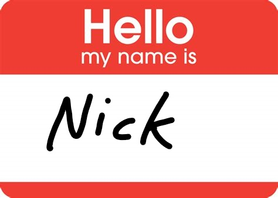

# nickbot

*the discord bot which can change people's nicknames*



## Purpose

**NOTE:** this was created for my own explicit use case. I don't expect this to be useful for anyone else, but feel free to reference the very simple script.

In a discord server, I couldn't find a direct method for letting equally-privileged admins change each other's nicknames. Everyone shared the same admin role, but discord doesn't seem to like equally-privileged users interacting in this way.

The workaround I found was to create a bot with higher privileges than everyone else and let it change nicknames for you. Thus *nickbot* was created.

## How it works

I've got *nickbot* setup as a bot which I've added to a discord server. Most of the magic takes place in that setup, but that is outside the scope of the bot script. I happen to run the bot on a Heroku dyno.

The bot is given a higher role than any user in the discord server so it can change nicknames of anyone. Then, users (restricted to admins) can use a bot command in the chat which invokes the bot to change the nickname of a specified user.

## Usage

```
!changenick @person#1234 "new_nickname"
```
